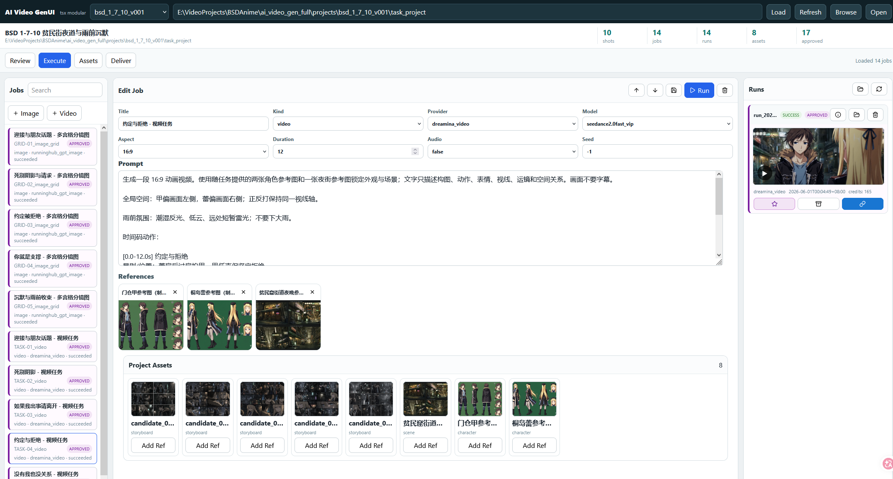
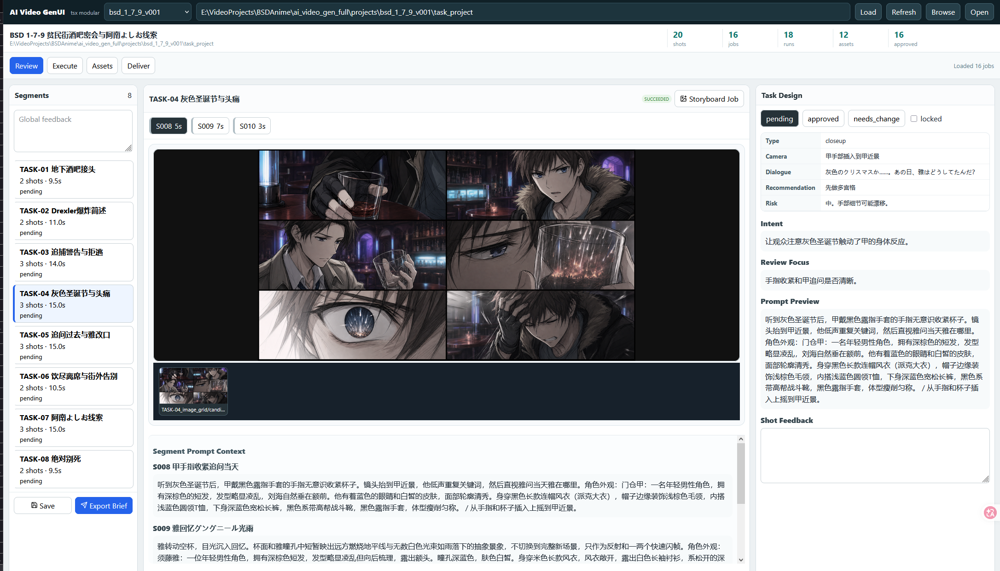

# AI Video Gen Full

这是一个本地单用户 AI 动画前期与生成执行工作包。当前主线是：

```text
原始剧情 -> 改编大纲 -> 粗脚本初稿 -> shot_plan -> 多宫格分镜图 -> WebUI Review/Execute -> 视频输出
```

看不懂镜头或构图不确定时，优先生成 GPT-image 多宫格分镜图，再在 WebUI 中审阅和迭代。

## Screenshots




## 快速启动 WebUI

后端会直接托管已构建前端：

```powershell
cd E:\VideoProjects\BSDAnime\ai_video_gen_full\webui
uv sync
npm install
npm run build
uv run uvicorn app.main:app --host 127.0.0.1 --port 8787
```

浏览器打开：`http://127.0.0.1:8787`

可加载实验项目：

```text
E:\VideoProjects\BSDAnime\ai_video_gen_full\projects\bsd_1_7_5\task_project
```

## 推荐工作流

新会话中通常只需要给 AI Agent 这样的短指令：

```text
从 bsd_anime_script/bsd_1_7_6.md 开始，帮我做一轮可在 WebUI 审阅的动画分镜项目。先检查剧情节奏和资产缺口，确认方向后生成 shot_plan 和 task_project。
```

具体步骤由 `AGENTS.md`、`docs/` 和 `skills/` 约束。

1. 用 `skills/script-adaptation-outline` 从 raw 剧情讨论并生成 `adaptation_outline.yaml`。
2. 用户确认大纲后，生成 `bsd_anime_script/bsd_*.md` 粗脚本初稿。
3. 用 `skills/storyboard-to-project` 生成 `shot_plan.json`、多宫格 prompt 和 WebUI 项目。
4. 在 WebUI 的 `Execute` 页先生成多宫格分镜图。
5. 在 `Review` 页按 shot 标记 `approved` / `needs_change`，导出 iteration brief。
6. AI Agent 读取 brief 后输出新版本，不覆盖旧版本。
7. 分镜通过后，在 `Execute` 页微调 prompt/refs 并执行视频任务。

## 关键目录

```text
docs/       # asset、adaptation outline、shot_plan 规范
skills/     # Agent 工作流技能
webui/      # FastAPI + React 本地工具
assets/     # 全局角色/场景参考图与 YAML
projects/   # 每个实验项目与 task_project
```

## Provider

WebUI 后端已接入：

- `dryrun`
- `runninghub_gpt_image`
- `runninghub_seedance`
- `dreamina_image`
- `dreamina_video`

付费 provider 需要在 UI 中显式确认。RunningHub API key 可放在任务项目或父目录 `.env`：

```text
RUNNINGHUB_APIKEY=...
```

不要分享 `.env`、`.venv`、`node_modules`、`dist` 或 API key。
